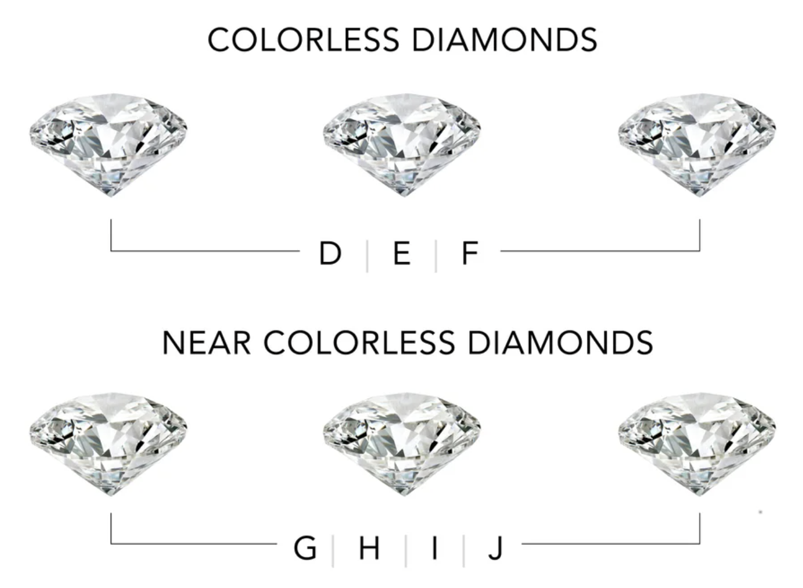
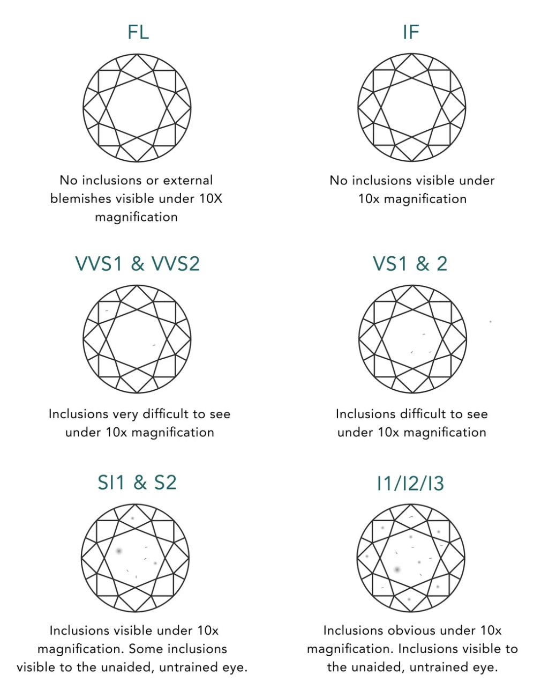

---
output:
  pdf_document:
    latex_engine: xelatex
  html_document: default
  word_document: default
---

```{=latex}
\begin{titlepage}
    \centering
    {\Huge\bfseries STA302 Final Project \par}
    {\LARGE What role do a diamond’s characteristics play in predicting its market value? \par}
    \vspace{0.3cm}
    {\large Yolanda Thant, Kosar Hemmati, Shameiza Hussain, Ayushi Verma\par}
    {\large 17 June, 2025\par}
\end{titlepage}
```

```{r setup, include=FALSE}
## Hides both code & output in knitted document 
library(tidyverse)  ## For data wrangling & plotting
library(kableExtra)
library(DescTools)
library(patchwork)
library(knitr)
library(kableExtra)
library(skimr)
library(broom)
library(MASS)   ## For Box-Cox Transformation Method
library(mgcv)   ## To fit GAM
library(car)    ## For VIF
library(boot)   ## For 10-Fold Cross-Validation

knitr::opts_chunk$set(echo = FALSE, message = FALSE, warning = FALSE)  ## Globally suppress all code, messages, & warnings
```

```{r}
## load original diamonds dataset
diamonds <- read_csv("./dataset/original_diamonds_dataset.csv")
## list.files("./dataset")
## getwd()
```

```{r}
## Data Cleaning: Rename x & y. Remove predictor variables we don't need: 1st col, cut, depth, z (height)
diamonds_cleaned <- diamonds %>%
  rename(length = x, width = y) %>%
  dplyr::select(-...1, -cut, -depth, -z) %>%
  mutate(
    color = as.factor(color),
    clarity = as.factor(clarity),
    width_transformed = log1p(width),
  )

write_csv(diamonds_cleaned, "./dataset/diamonds_cleaned.csv")
```

\section*{Section 1: Introduction}
When considering a diamond’s value, many consumers rely on a grading system introduced by the Gemological Institute of America (n.d.) called the “4Cs”: carat, cut, clarity, and color. This system was designed to help buyers understand the value of their diamond purchases based on the values assigned to each of these four traits. While information about factors that influence diamond pricing is publicly available, the numeric impact of each factor is unclear (Lee et al., 2014; Mamonov & Triantoro, 2018). For instance, two diamonds of the same weight can differ vastly in price after accounting for cut, clarity, and color (Tiffany & Co., n.d.), but the explanation behind this variance has not been rigorously quantified based on our literature research. Thus, our research addresses the question: To what extent do carat, color, clarity, table size, and length predict the price of a diamond? While previous studies have conducted similar analyses (Mamonov & Triantoro, 2018; Özmen, 2024), our goal is to later refine our model in hopes of explaining more of the observed price variation in our data. Quantifying the effects that different features have on diamond prices can better inform consumers’ judgments on whether they are paying a fair price. 
 
Multiple linear regression (MLR) is a suitable method to answer our question because we are exploring the association between price, a continuous response variable, with several explanatory variables simultaneously. This way, we can infer which diamond factors are the strongest predictors of price. MLR models the (estimated) average of the response versus given values of the predictors, which is relevant to our goal of helping consumers understand where the price of their diamond lies in relation to the estimated average price for their specific diamond profile. The focus of the model will be on interpretability since we are more interested in drawing conclusions about the average effects of our chosen diamond attributes on the price, rather than trying to predict exact prices of all diamonds.

\section*{Section 2: Data Description}
The selected dataset was retrieved and downloaded from Kaggle (Al Aswad, 2022). No explicit research purpose was linked to dataset; our research question was constructed after a careful review of variables and corresponding literature surrounding diamond pricing. Further investigation of the dataset revealed it was originally published in ggplot2 R package (Wickham et al., n.d.). This diamond dataset was curated by ggplot2 contributors—using Loose Diamond Search Engine (n.d.)—containing historical data on diamond prices and their physical attributes.

\subsection*{Response Variable Summary}
Jewelers justify diamond valuations using physical attributes: cut, carat, color, and size. Thus, price is an appropriate response variable as it’s determined by these predictors. Further, price is a continuous numerical value measured in USD—suitable for linear regression analysis. Price values of the dataset feature a **large spread** and a **heavy right-skew**, indicating the “rarity” of premium diamonds.

```{r}
## Numerical Summary of Response Variable
price <- diamonds_cleaned$price
response_numeric_sum <- data.frame(
  Statistic = c("Minimum", "1st Quartile", "Median", "Mode", "Mean", "Standard Deviation", "3rd Quartile", "Maximum"),
  Value = round(c(min(price), quantile(price, 0.25), median(price), Mode(price), mean(price), sd(price), quantile(price, 0.75), max(price)), 3)
)

kable(response_numeric_sum, caption="Numerical Summary of Response Variable")
```
\subsection*{Scatterplot Matrix}
```{r}
## Scatterplot Matrix of Entries
plot(diamonds_cleaned[,c("price", "carat", "color", "clarity", "table", "length", "width")])
```

\subsection*{Predictor Variable Summaries}
```{r, fig.width=13, fig.height=9}
## Numerical Summary of Quantitative Predictor Variables
## Table & Transpose
numeric_sum <- diamonds_cleaned %>%
  summarise(
    Min=c(min(carat), min(table), min(length)),
    Q1=c(quantile(carat, 0.25), quantile(table, 0.25), quantile(length, 0.25)),
    Median=c(median(carat), median(table), median(length)),
    Mode=c(Mode(carat), Mode(table), Mode(length)),
    Mean=c(mean(carat), mean(table), mean(length)),
    StandardDeviation=c(sd(carat), sd(table), sd(length)),
    Q3=c(quantile(carat,0.75), quantile(table,0.75), quantile(length,0.75)),
    Max=c(max(carat), max(table), max(length))
  ) %>%
  t() %>%
  as.data.frame()

# Label cols & row labels
colnames(numeric_sum) <- c("Carat", "Table", "Length")
numeric_sum$Statistic <- c("Minimum", "1st Quartile", "Median", "Mode", "Mean", "Standard Deviation", "3rd Quartile", "Maximum")

## Reorder cols
numeric_sum <- numeric_sum[, c("Statistic", "Carat", "Table", "Length")]

# Round values
numeric_sum <- numeric_sum %>%
  mutate(across(c(Carat, Table, Length), ~ round(as.numeric(.), 3)))

kable(numeric_sum, caption = "Numerical Summary of Quantitative Predictor Variables", row.names=FALSE)


carat_hist <- ggplot(diamonds_cleaned, aes(x=carat)) +
  geom_histogram(bins=30, fill="lightblue", color="black") +
  labs(title="Histogram of Carat", x="Carat", y="Frequency")

table_hist <- ggplot(diamonds_cleaned, aes(x=table)) + 
  geom_histogram(bins=30, fill="lightblue", color="black") +
  labs(title="Histogram of Table", x="Table", y="Frequency")

length_hist <- ggplot(diamonds_cleaned, aes(x=length)) + 
  geom_histogram(bins=30, fill="lightblue", color="black") +
  labs(title="Histogram of x (Length)", x="Length", y="Frequency")

(carat_hist | table_hist | length_hist)

##-----------------------------------------------------------------------------------------------##

## Frequency & Percentage for each 'color' level
color_freq <- table(diamonds_cleaned$color)
color_prop <- prop.table(color_freq)

## Combine into a data frame
color_catego_df <- data.frame(
  Color=names(color_freq),
  Frequency=as.numeric(color_freq),
  Percentage=round(as.numeric(color_prop)*100, 3)
)
kable(color_catego_df, caption="Numerical Summary of 'Color' Predictor")

## Frequency & Proportion for each 'clarity' level
clarity_freq <- table(diamonds_cleaned$clarity)
clarity_prop <- prop.table(clarity_freq)

## Combine into a data frame
clarity_catego_df <- data.frame(
  Clarity=names(clarity_freq),
  Frequency=as.numeric(clarity_freq),
  Percentage=round(as.numeric(clarity_prop)*100, 3)
)
kable(clarity_catego_df, caption="Numerical Summary of 'Clarity' Predictor")

## Graphical Summary of Predictor Variables

## Boxplot confirms that color is not constant & shows some variation in price.
## Can use as predictor in modeling price.
price_color_box <- ggplot(data=diamonds_cleaned, aes(x=color, y=price)) +
  geom_boxplot(fill="lightblue", color="black") +
  labs(title="Boxplot of Price by Color",
       x="Color", y="Price")

## Boxplot confirms that clarity does is not constant & shows meaningful variation in price.
## Can use as predictor in modeling price.
price_clarity_box <- ggplot(data=diamonds_cleaned, aes(x=clarity, y=price)) +
  geom_boxplot(fill="lightblue", color="black") +
  labs(title="Boxplot of Price by Clarity",
       x="Clarity", y="Price")

(price_color_box | price_clarity_box)
```
**Renamed Variables** 

Our dataset features predictors “x”, “y”, and “z” as diamond dimensions. We rename “x” to “length”, “y” to “width”, and “z” to “height” for clarity. width wasn’t included in the preliminary model, yet it’s included in the scatterplot matrix for reference in future sections.

**Carat – diamond weight (1 carat = 0.2 grams)** 

- Large spread, heavy right-skew mirroring price histogram
- Rarity of high carat and histogram similarity suggest carat to be strongest predictor of price

**Table – width of diamond’s top surface as % of total width**  

- Large spread due to heavy right tail, mild right-skew
- Rarity of high table % suggest relationship with price

**Length – length (in mm) of diamond**

- Large spread, slight right-skew
- Overestimated spread due to nonsensical zero entries (requires data cleaning)
- Rarity of longer diamonds suggest relationship with price

**Color – grading from best (D) to worst (J) (Diamond Color Scale, n.d.)** 

- Frequency peak around medium grade (G)
- Each grading has heavy right-skew
- Changes in median price and number of outliers among color grades suggests relationship with price

**Clarity – grading from best (IF) to worst (I1) (Diamond Clarity Guide, n.d.)** 

- Frequency peak around medium grades (VS2 & SI1)
- Each grading has heavy right-skew
- Clarity decline corresponds to lower medians suggesting relationship with price

```{r include-images, fig.align='center', out.width='37%', fig.cap='\\small Color (Diamond Color Scale, n.d.) and Clarity (Diamond Clarity Guide, n.d.) Gradings for Diamonds'}
## Pictures for color & clarity gradings


```

```{r}
## Preliminary (MLR) Model Setup
fit <- lm(price ~ carat + color + clarity + table + length, data=diamonds_cleaned)
```

```{r}
## Residual vs Fitted Values Plot | NOTE: Best plot among the 3 1(a)(b)(c) to check for 1st 2 assumptions
resid_fit <- data.frame(Fitted = fitted(fit), Residuals = resid(fit))
resid_fitted <- ggplot(data=resid_fit, aes(x=Fitted, y=Residuals)) +
  geom_point(alpha=0.4) +  ## Transparency level to help w/ overlapping pts
  geom_smooth(method = "loess", se = FALSE, color = "blue") +
  geom_hline(yintercept = 0, linetype = "dashed", color = "grey") +
  labs(x="Fitted Values", y="Residuals",
       title="Residuals vs Fitted Values")
```

```{r}
## Response vs Fitted Values Plot
price_fitted <- ggplot(data=diamonds_cleaned, aes(x=fitted(fit), y=price)) +
  geom_point(alpha=0.3) +  ## Transparency level to help w/ overlapping pts
  geom_abline(color="blue") +
  labs(x="Fitted Values", y="Actual Price",
       title="Price vs Fitted Values")
```

```{r}
## Response vs Predictor Values Plot
price_carat <- ggplot(data=diamonds_cleaned, aes(x=carat, y=price)) +
  geom_point(alpha=0.2) +
  geom_smooth(method="lm", color="blue", se=FALSE) +
  labs(title="Price vs Carat")

price_color <- ggplot(data=diamonds_cleaned, aes(x=color, y=price)) +
  geom_point(alpha=0.2) +
  geom_smooth(method="lm", color="blue", se=FALSE) +
  labs(title="Price vs Color")

price_clarity <- ggplot(data=diamonds_cleaned, aes(x=clarity, y=price)) +
  geom_point(alpha=0.2) +
  geom_smooth(method="lm", color="blue", se=FALSE) +
  labs(title="Price vs Clarity")

price_table <- ggplot(data=diamonds_cleaned, aes(x=table, y=price)) +
  geom_point(alpha=0.2) +
  geom_smooth(method="lm", color="blue", se=FALSE) +
  labs(title="Price vs Table")

price_length <- ggplot(data=diamonds_cleaned, aes(x=length, y=price)) +
  geom_point(alpha=0.2) +
  geom_smooth(method="lm", color="blue", se=FALSE) +
  labs(title="Price vs Length")
```

```{r}
## Histogram of Standardized Residuals
std_resid <- rstandard(fit)
sresid_hist <- ggplot(data=data.frame(std_resid), aes(x=std_resid)) +
  geom_histogram(bins=30, fill="lightblue", color="black") +
  labs(title="Histogram of Standardized Residuals",
       x="Standardized Residuals", y="Frequency")
```

```{r}
## Normal QQ-Plot of Standardized Residuals
sresid_qq <- ggplot(data=data.frame(std_resid), aes(sample=std_resid)) +
  stat_qq(alpha=0.2) +
  stat_qq_line(color="red", linetype="dashed") +
  labs(title="Normal QQ-Plot of Standardized Residuals", 
       x="Theoretical Quantiles", y="Standardized Residuals")
```

\section*{Section 3: Primary Model Results and Diagnostics}
\subsection*{Diagnostic Plots and Fitted Model}
```{r, fig.width=15, fig.height=17}
(resid_fitted | price_fitted | price_carat) / 
  (price_color | price_clarity | price_table) / 
  (price_length | sresid_hist | sresid_qq)
```

\begin{align*}
y =\ & \beta_0 + \beta_1 \cdot \text{carat} + \beta_2 \cdot I(\text{color} = E) + \beta_3 \cdot I(\text{color} = F) + \beta_4 \cdot I(\text{color} = G) + \beta_5 \cdot I(\text{color} = H) \\
& + \beta_6 \cdot I(\text{color} = I) + \beta_7 \cdot I(\text{color} = J) + \beta_8 \cdot I(\text{clarity} = \text{IF}) + \beta_9 \cdot I(\text{clarity} = \text{SI1}) \\
& + \beta_{10} \cdot I(\text{clarity} = \text{SI2}) + \beta_{11} \cdot I(\text{clarity} = \text{VS1}) + \beta_{12} \cdot I(\text{clarity} = \text{VS2}) \\
& + \beta_{13} \cdot I(\text{clarity} = \text{VVS1}) + \beta_{14} \cdot I(\text{clarity} = \text{VVS2}) + \beta_{15} \cdot \text{table} + \beta_{16} \cdot length + \epsilon \\[0.5em]
\text{} & \text{Assume } \mathbb{E}[\epsilon] = 0, \mathbb{V}[\epsilon] = \sigma^2, \text{and } \epsilon \overset{\text{i.i.d.}}{\sim} N(0, \sigma^2) \\[0.5em]
\hat{E}[y] =\ & \hat{y} =\ \hat{\beta}_0 + \hat{\beta}_1 \cdot \text{carat} + \hat{\beta}_2 \cdot I(\text{color} = E) + \hat{\beta}_3 \cdot I(\text{color} = F) + \hat{\beta}_4 \cdot I(\text{color} = G) + \hat{\beta}_5 \cdot I(\text{color} = H) \\
& + \hat{\beta}_6 \cdot I(\text{color} = I) + \hat{\beta}_7 \cdot I(\text{color} = J) + \hat{\beta}_8 \cdot I(\text{clarity} = \text{IF}) + \hat{\beta}_9 \cdot I(\text{clarity} = \text{SI1}) \\
& + \hat{\beta}_{10} \cdot I(\text{clarity} = \text{SI2}) + \hat{\beta}_{11} \cdot I(\text{clarity} = \text{VS1}) + \hat{\beta}_{12} \cdot I(\text{clarity} = \text{VS2}) \\
& + \hat{\beta}_{13} \cdot I(\text{clarity} = \text{VVS1}) + \hat{\beta}_{14} \cdot I(\text{clarity} = \text{VVS2}) + \hat{\beta}_{15} \cdot \text{table} + \hat{\beta}_{16} \cdot length
\end{align*}

```{r}
## Numerical Summary of Coefficient Estimates
coef_esti_numeric_sum <- data.frame(
  Term = c("(Intercept)", "carat", "colorE", "colorF", "colorG", "colorH", "colorI", "colorJ",
           "clarityIF", "claritySI1", "claritySI2", "clarityVS1", "clarityVS2", "clarityVVS1", "clarityVVS2",
           "table", "length"),
  Estimate = c(-1388.839, 10945.695, -210.489, -286.752, -493.858, -993.809, -1474.570, -2387.941,
               5665.892, 3894.266, 2926.092, 4845.059, 4528.148, 5309.983, 5234.228, -32.708, -900.270)
)
kable(coef_esti_numeric_sum, digits=3, caption="Numerical Summary of Coefficient Estimates")
```

\subsection*{Residual Analysis}
The curvature in the **Residuals vs. Fitted Values** and **Price vs. Fitted Values** plots, and the exponential trend in the **Price vs Carat** plot suggests non-linearity. Spread increasing with fitted values indicates heteroscedasticity.   

**Color** and **clarity** don’t appear as strong predictors of **price** due to visible constant spread of points across levels. However, boxplots—shown in above reveal stratified effects on price—confirming their contribution to **price** variation.  
  
Although maximum prices are similar across levels of **color**, median prices differ. **Color** J shows higher medians while D shows higher outliers.  

Diamonds with **clarity** I1 show outliers and higher median prices, whereas **clarity** IF shows more outliers and lower medians. This stratification supports both being valid diamond price predictors.  
 
The **Price vs Table** plot showed a weak, noisy association with data points concentrated in a narrow range, suggesting **table** size may not strongly predict price. The **Price vs Length** plot also curves, suggesting non-linearity.  
 
The **histogram of standardized residuals** sharply peaked around 0 with heavy tails, and **normal QQ-plot** showed deviations at both tails—violating normality of errors.   
 
From the model estimates, a diamond with **color** D, **clarity** I1, and 0 for **table**, **length**, and **carat**, predicted an average **price** of -\$1,388.389. Though not practically meaningful, it serves as the model’s baseline. 

Keeping the same values for continuous predictors with **color** E and **clarity** IF, the estimated average **price** increases to \$4,066.564, reflecting strong contribution of high **clarity**.

With the same values, a 1-gram increase in **carat** raises predicted average price by \$10,945.695/**carat**, confirming **carat** as the strongest predictor.  
 
Interestingly, **table** and **length** are negatively associated with **price**: coefficients −\$32.71 and −\$900.27, respectively. This is counterintuitive as larger dimensions are generally desirable. **Length** potentially reflects multicollinearity with **carat**; both capture size-related information, suggesting we can remove/replace **length**. 

\section*{Section 4: Model Selection}
```{r}
## Preliminary (MLR) Model Setup
fit <- lm(price ~ carat + color + clarity + length + width, data=diamonds_cleaned)
```
\subsection*{Replacing Table Predictor With Width}
Our residual analysis revealed that although the scatterplot for **Price vs Table** has some predictive power, its high noise and lack of clear trend indicates **table** is a poor standalone predictor of diamond price. However, visually, the relationship between the response and the predictor showed no association, suggesting no visible trend or pattern. With this interpretation, we came to the conclusion that **table** provided no significant detail about prices. 

We then considered **width** and by the scatterplot between the response and the predictor, we were able to observe a more visible trend and an improved line of best fit. We observed a strong positive trend, and the reduced spread of data points through the plot facilitated the visual interpretation of the relationship between the width and price. 

\subsection*{Model Transformations}
Applying transformations to our preliminary model was necessary for correcting major violations of regression assumptions: linearity, constant error variance (homoscedasticity), and normality of errors. Satisfying these conditions, especially normality of errors, is crucial for obtaining reliable estimates of key model parameters (e.g. slope coefficients of predictors) using hypothesis tests and confidence intervals. These corrections are also important for the predictive power of our model and accurately specifying the proposed linear relationship between diamond price and its predictors. 

Given our model's very large sample size (n > 53,000), we do not require perfectly normally distributed errors. Rather, by the Central Limit Theorem, the sampling distributions of our parameter estimates are approximately normal, validating the use of hypothesis tests and confidence intervals as estimation tools. 

\subsubsection*{Box-Cox Transformation of Price} 

Although our large sample size reduces the importance of improving normality, we still applied the Box-Cox transformation on price to stabilize residual variance and normalize the distribution of residuals. Using the boxcox() function, we found that $𝛌$ = 0.1414141 was the optimal value to transform price with. This power transformation reduces skewness in the response, which improves normality and homoscedasticity as a byproduct.

```{r}
## Box-Cox Transformation Method
box_cox <- boxcox(fit)
lambda <- box_cox$x[which.max(box_cox$y)]     ## lambda = 0.1414141   

## Define response variable
y <- diamonds_cleaned$price

## Geometric Mean
geom_mean <- exp(mean(log(y)))        ## Didn't use prod(y)^(1/n) bc of dataset overflow

## Transform & Fit the model
y_transformed <- geom_mean^(1-lambda)*(y^lambda-1) / lambda

transformed_fit <- lm(y_transformed ~ log(carat) + color + clarity + length + width_transformed, data=diamonds_cleaned)
```
\subsubsection*{Log Transformation of Carat} 

As shown in the preliminary model results, carat appears to be exponentially related to price. We applied a log transformation to carat to linearize this relationship, allowing us to better predict price using a straight line model. 

\subsubsection*{Log1p Transformation of Width}
Diamond width observations were right skewed, with some values near zero. To still effectively use these observations to develop our model, we applied a log1p transformation (log(1 + width)) to width. This transformation also stabilized error variance and improved its linearity with price, especially in the lower range of width values.

\subsection*{Addressing Non-Linearity and Heteroscedasticity: GAM and WLS-GAM}
To address remaining violations of linearity, we fit a Generalized Additive Model (GAM) to our transformed model. This model maintains additive effects of the predictors on price while smoothing out each individual predictor’s effect where needed to better fit the model. This improves predictive accuracy by capturing non-linear relationships between price and its predictors, which is more representative of real-life scenarios. 

We then used the Weighted Least Squares (WLS) method to further stabilize homoscedasticity in the GAM. This method gives greater influence on our model’s predictions to more reliable observations. That is, observations with smaller error variances. This not only evens out the spread of residuals across fitted values but also leads to more precise coefficient estimates. As shown in the **Residuals vs. Fitted Values** plots for the GAM and WLS-GAM, using WLS on the GAM improved homoscedasticity beyond just using the GAM. This is indicated by the flatter blue LOESS line in the latter plot. 
```{r}
## Generalized Additive Model (GAM)
gam_fit <- gam(y_transformed ~ s(carat) + color + clarity + s(length) + s(width_transformed),
               data = diamonds_cleaned)

## Initial GAM Residual Plot
resid_fit_gam <- data.frame(Fitted = fitted(gam_fit), Residuals = resid(gam_fit))
resid_fitted_gam <- ggplot(data=resid_fit_gam, aes(x = Fitted, y = Residuals)) +
  geom_point(alpha = 0.4) +
  geom_smooth(method = "loess", se = FALSE, color = "blue") +
  geom_hline(yintercept = 0, linetype = "dashed", color = "grey") +
  labs(title = "GAM: Residuals vs Fitted Values")

## Estimate variance of residuals to model heteroscedasticity
gam_resid <- resid(gam_fit)^2
var_model_gam <- lm(log(gam_resid) ~ fitted(gam_fit))
predicted_var <- exp(fitted(var_model_gam))

## Calculate weights (inverse variance)
weights_gam <- 1 / predicted_var

## WLS-GAM: Refit GAM with weights. WLS -> Weighted Least Squares Regression
gam_fit_weighted <- gam(y_transformed ~ s(carat) + color + clarity + s(length) + s(width_transformed), 
                        data=diamonds_cleaned, weights = weights_gam)

## Plot residuals of WLS-weighted GAM
resid_fit_gam_weighted <- data.frame(
  Fitted = fitted(gam_fit_weighted),
  Residuals = resid(gam_fit_weighted)
)
resid_fitted_gam_weighted <- ggplot(data=resid_fit_gam_weighted, aes(x = Fitted, y = Residuals)) +
  geom_point(alpha = 0.4) +
  geom_smooth(method = "loess", se = FALSE, color = "blue") +
  geom_hline(yintercept = 0, linetype = "dashed", color = "grey") +
  labs(title = "WLS-GAM: Residuals vs Fitted Values")

(resid_fitted_gam | resid_fitted_gam_weighted)
```
\subsection*{Problematic Observations: Leverage Points, Outliers, Influential Points}
We checked our transformed model for points that differ significantly from others (leverage points and outliers), or may overly impact our model’s predictions depending on their presence in the data (influential points). 

To find leverage points, we compute the hat value of observations and use the appropriate cutoff values to classify points where the predictor value deviates significantly from its corresponding average. Next, we compute standard residuals and find outliers using an absolute deviation of 4 as our cutoff threshold. Then, we used Cook’s Distance and difference in fitted values (DFFITS) to detect influential points. Both methods revealed the same number of influential points, with higher values of both measures corresponding to higher influence. Finally, we computed the number of points that satisfied more than one or all three problematic observation criteria. 

```{r}
layout(matrix(c(1, 2,
                3, 4), nrow = 2, byrow = TRUE))

## Leverage Point(s)
mod.hii <- hatvalues(transformed_fit)

## Levarage Point(s) Plot
plot(mod.hii, type="h", ylab="hii", main="Leverage Points")
## Define the cutoff for leverage points
cutoff.leveragepoints <- 2*(17+1)/nrow(diamonds_cleaned)
cutoff.leveragepoints.bis <- 3*(17+1)/nrow(diamonds_cleaned)
abline(h=cutoff.leveragepoints,col="red")
abline(h=cutoff.leveragepoints.bis,col="blue")
abline(h=0.5,col="green")
## mod.hii
## length(which(mod.hii>cutoff.leveragepoints))
## 1822 leverage points

## Outlier(s)
transformed_sresid <- rstandard(transformed_fit)

# Standardized Residuals Plot
plot(transformed_sresid, type = "h",
     main = "Standardized Residuals",
     ylab = "Standardized Residuals")
abline(h = 4, col = "red")
abline(h = -4, col = "red")

# Identify points where |standardized residual| > 4
## length(which(abs(transformed_sresid) > 4))
## 103 outliers

## Influential Point(s) via Cook's Distance
cook_dii <- cooks.distance(transformed_fit)

## Cook's Distance Plot
plot(cook_dii, type = "h", ylab = "Cook's Distance", main = "Cook's Distance")
cutoff_dii <- qf(0.5, df1 = 17, df2 = nrow(diamonds_cleaned) - 17)
abline(h = cutoff_dii, col = "red")                # F-distribution cutoff (mild)
abline(h = 1, col = "blue")                        # Heuristic flag
abline(h = 4 / nrow(diamonds_cleaned), col = "green")  # Common threshold for large n

# Influential points: using 4/n cutoff
## length(which(cook_dii > (4 / nrow(diamonds_cleaned))))
## 2502 influential points

## Influential points via DFFITS
dffits_vals <- dffits(transformed_fit)

# DFFITS Plot
plot(dffits_vals, type = "h", ylab = "DFFITS", main = "DFFITS")
cutoff_dffits <- 2 * sqrt(17 / nrow(diamonds_cleaned))
abline(h = cutoff_dffits, col = "red")
abline(h = -cutoff_dffits, col = "red")

# Influential points: using DFFITS cutoff
## length(which(abs(dffits_vals) > cutoff_dffits))
## 2502 entries
layout(1)
```

```{r}
# Identify problematic points
high_lev_pts <- which(mod.hii > cutoff.leveragepoints)
outliers <- which(abs(transformed_sresid) > 4)
influential <- which(cook_dii > (4 / nrow(diamonds_cleaned)))

# Define intersections using helper function
count_intersect <- function(...) length(Reduce(intersect, list(...)))

# Create summary table directly
summary_df <- data.frame(
  Category = c(
    "Leverage Points",
    "Outliers",
    "Influential Points",
    "Leverage and Influential",
    "Outlier and Influential",
    "Leverage and Outlier",
    "All Three"
  ),
  Count = c(
    length(high_lev_pts),
    length(outliers),
    length(influential),
    count_intersect(high_lev_pts, influential),
    count_intersect(outliers, influential),
    count_intersect(high_lev_pts, outliers),
    count_intersect(high_lev_pts, outliers, influential)
  )
)

# Display table
kable(summary_df, caption = "Summary of Problematic Observations")

## n_lev_inf    ## 794 points
## n_out_inf    ## 103 points
## n_lev_out    ## 76 points
## n_all_three  ## 76 points
```

Although 76 data points were flagged by all three measures of problematic observations, we retained these observations to represent the complete dataset in our model. The limitations of keeping all data points include distorted predictions and inflated standard errors. However, these observations reflect real market data and make up only 0.14% of our dataset, which minimizes their impact. Furthermore, they do not appear to be data entry errors or unrealistic values in the context of diamond prices.

\subsection*{Variable Selection: Multicollinearity, VIF, AIC, BIC}

\subsubsection*{$R^{2}_{adj}$, AIC, BIC}
We compared our transformed model to three other models: the full model (Model 1), preliminary model (Model 2), and a model replacing the clarity predictor with cut and using diamond height (z) as an additional predictor (mMdel 3). Our model selection table (Table 1) shows that our transformed model (model 4) outperforms the other three based on three criteria: $R^{2}_{adj}$, Akaike Information Criterion (AIC), and Bayesian Information Criterion (BIC). 

The transformed model had the highest $R^{2}_{adj}$ of approximately 97.89%. This indicates that the model accounts for the largest proportion of variation in diamond price. The transformed model also had the lowest AIC and BIC values (788582.8 and 788742.9, respectively). Lower values of these criteria suggest that this model does the best job of balancing predictive accuracy with model simplicity. 

```{r}
## Variable Selection / Model Comparison
## Full Model
model_1 <- lm(price ~ carat + cut + color + clarity + depth + table + x + y + z, data=diamonds)

## Preliminary Model
model_2 <- lm(price ~ carat + color + clarity + length + width, data=diamonds_cleaned)

## Model 3
model_3 <- lm(price ~ carat + cut + color + x + y + z, data=diamonds)

## Transformed Model
model_4 <- transformed_fit

model_selection <- data.frame(
  Model = c(1, 2, 3, 4), 
  "$R^{2}_{adj}$" = round(c(summary(model_1)$adj.r.squared, summary(model_2)$adj.r.squared, 
                   summary(model_3)$adj.r.squared, summary(model_4)$adj.r.squared), 4),
  AIC = c(AIC(model_1), AIC(model_2), AIC(model_3), AIC(model_4)),
  BIC = c(BIC(model_1), BIC(model_2), BIC(model_3), BIC(model_4)),
  check.names = FALSE
)
kable(model_selection, caption="Model Selection Table", escape = FALSE)
```

\subsubsection*{Variation Inflation Factor (VIF) and Multicollinearity}
To investigate possible multicollinearity, we looked at the Variance Inflation Factors (VIF) of each predictor in our transformed model. VIF values higher than 5 are cause for concern as it could mean that our model contains redundant predictors. We observed VIF values of 55.35, 84.29, and 54.68 for log(carat), length, and width_transformed (log(1 + width)), respectively. Since each of these predictors relate to size, perhaps not all of them are necessary to include. However, automated step-wise variable selection produced the same model as our transformed model, suggesting that multicollinearity was not severe enough to exclude any predictors. Furthermore, each predictor’s estimated effect on price is statistically significant, reinforcing that all of the selected predictors should be included. 

```{r}
## Variation Inflation Factor (VIF)
vif_results <- vif(transformed_fit)

## summary(transformed_fit)$r.squared
## summary(transformed_fit)$adj.r.squared
## AIC(transformed_fit)
## BIC(transformed_fit)
## summary(fit)$r.squared
## summary(fit)$adj.r.squared
## AIC(fit)
## BIC(fit)

kable(vif_results, caption = "Generalized Variance Inflation Factors (GVIF)")
```

```{r}
## Variable Selection
## new_transformed_fit <- step(transformed_fit, direction = c("both"))
step_wise_model <- tidy(transformed_fit, conf.int = FALSE) %>%
  rename(
    "Term" = term,
    "Estimate" = estimate,
    "Std. Error" = std.error,
    "p-value" = p.value,
  ) %>%
  dplyr::select(-statistic) %>%
  mutate(
    Estimate = round(`Estimate`, 3),
    `Std. Error` = round(`Std. Error`, 3),
    `p-value` = ifelse(`p-value` <2e-16, "<2e-16", formatC(`p-value`, format = "e", digits = 2)),
  )

kable(step_wise_model, caption = "Automated Step-Wise Variable Selection Model Results")
```

\section*{Section 5: Final Model Inference and Results}

\subsection*{Model Validation}

\subsubsection*{80/20 Training-Testing Set and K-Fold Cross-Validation Selection}

```{r, fig.width=9, fig.height=6}
compute_test_mse <- function(formula, data, lambda = NULL, transform_response = FALSE) {
  set.seed(123)  # for reproducibility
  n <- nrow(data)
  train_idx <- sample(seq_len(n), size = 0.8 * n)
  train <- data[train_idx, ]
  test <- data[-train_idx, ]
  
  if (transform_response && !is.null(lambda)) {
    gm <- exp(mean(log(train$price)))
    train$y_trans <- gm^(1 - lambda) * (train$price^lambda - 1) / lambda
    test$y_trans <- gm^(1 - lambda) * (test$price^lambda - 1) / lambda
    model <- lm(y_trans ~ ., data = train[, c(all.vars(formula), "y_trans")])
    preds <- predict(model, newdata = test)
    mse <- mean((test$y_trans - preds)^2)
  } else {
    model <- lm(formula, data = train)
    preds <- predict(model, newdata = test)
    mse <- mean((test$price - preds)^2)
  }
  return(mse)
}

## Model 1: Full Model
mse_model_1 <- compute_test_mse(
  price ~ carat + cut + color + clarity + depth + table + x + y + z,
  data = diamonds
)

## Model 2: Preliminary Model
mse_model_2 <- compute_test_mse(
  price ~ carat + color + clarity + length + width,
  data = diamonds_cleaned
)
## Model 3
mse_model_3 <- compute_test_mse(
  price ~ carat + cut + color + x + y + z,
  data = diamonds
)

## Model 4: Final Transformed Model
mse_model_4 <- compute_test_mse(
  y_trans ~ log(carat) + color + clarity + length + width_transformed,
  data = diamonds_cleaned,
  lambda = 0.1414141,
  transform_response = TRUE
)

validation_results <- data.frame(
  Model = c(
    "Model 1: Full Model (carat + cut + color + clarity + depth + table + x + y + z)",
    "Model 2: Preliminary Model (carat + color + clarity + length + width)",
    "Model 3: (carat + cut + color + x + y + z)",
    "Model 4: Final Transformed Model (log(carat), width_transformed, Box-Cox)"
  ),
  Test_MSE = round(c(mse_model_1, mse_model_2, mse_model_3, mse_model_4), 2)
)

## 10-Fold Cross-Validation

## Transformed model helper function - fit transformed response via Box-Cox lambda & return CV error
cv_mse_transformed <- function(data, lambda, K = 10) {
  gm <- exp(mean(log(data$price)))
  data$y_trans <- gm^(1 - lambda) * (data$price^lambda - 1) / lambda
  formula_trans <- y_trans ~ log(carat) + color + clarity + length + width_transformed
  glm_fit <- glm(formula_trans, data=data)
  cv.glm(data, glm_fit, K = K)$delta[1]   ## delta[1] Estimated CV MSE
}

cv_mse_model_1 <- cv.glm(diamonds, glm(price ~ carat + cut + color + clarity + depth + table + x + y + z, data=diamonds), K = 10)$delta[1]
cv_mse_model_2 <- cv.glm(diamonds_cleaned, glm(price ~ carat + color + clarity + length + width, data=diamonds_cleaned), K = 10)$delta[1]
cv_mse_model_3 <- cv.glm(diamonds, glm(price ~ carat + cut + color + x + y + z, data=diamonds), K = 10)$delta[1]
cv_mse_model_4 <- cv_mse_transformed(diamonds_cleaned, lambda = 0.1414141, K = 10)

cv_results <- data.frame(
  Model = c("Model 1: Full Model (carat + cut + color + clarity + depth + table + x + y + z)",
    "Model 2: Preliminary Model (carat + color + clarity + length + width)",
    "Model 3: (carat + cut + color + x + y + z)",
    "Model 4: Final Transformed Model (log(carat), width_transformed, Box-Cox)"
    
  ),
  CV_MSE = round(c(cv_mse_model_1, cv_mse_model_2, cv_mse_model_3, cv_mse_model_4), 2)
)

combined_mse <- merge(validation_results, cv_results, by = "Model")
kable(combined_mse, caption = "Comparison of Test Set and Cross-Validation MSE")


combined_long <- combined_mse %>%
  pivot_longer(cols = c(Test_MSE, CV_MSE), names_to = "Metric", values_to = "MSE")

ggplot(combined_long, aes(x = reorder(Model, MSE), y = MSE, fill = Metric)) +
  geom_col(position = "dodge") +
  coord_flip() +
  labs(title = "Test Set vs Cross-Validation MSE", x = "Model", y = "MSE")
```
To select and validate the final transformed model, we conducted both Train-Test Split (80/20) and K-Fold Cross-Validation techniques. In both tests, the transformed model outperformed the alternative models by a wide margin. In the Train-Test Split, the Mean Standard Error (MSE) of the transformed model was a $\frac{1}{6}$th of the next best model. The K-Fold Cross-Validation offered more robust and stable testing of the model's generalizability with the transformed model's MSE being up to a $\frac{1}{10}$th of the next best model. These validation techniques confirm the selection of Model 4 as the most accurate and generalizable choice. Compounded with the AIC and BIC analysis from Section 4, and the high $R^{2}$ values, we are highly confident that our model is suitable to answer our research question.

\subsubsection*{Transformed Model Plots}

```{r}
## Transformed Response vs Fitted Values Plot

## Use fitted values from the WLS-GAM model
price_fitted <- ggplot(data = diamonds_cleaned, aes(x = fitted(gam_fit_weighted), y = y_transformed)) +
  geom_point(alpha = 0.3) +
  geom_abline(color = "blue") +
  labs(x = "Fitted Values", y = "Transformed Price",
       title = "WLS-GAM: Transformed Price vs Fitted Values")
```

```{r}
## Transformed Response vs Individual Predictor Values Plot
price_carat <- ggplot(data=diamonds_cleaned, aes(x=log(carat), y=y_transformed)) +
  geom_point(alpha=0.2) +
  geom_smooth(method="lm", color="blue", se=FALSE) +
  labs(title="Price vs Carat") +
  coord_cartesian(ylim = c(0, 20000))

price_color <- ggplot(data=diamonds_cleaned, aes(x=color, y=y_transformed)) +
  geom_point(alpha=0.2) +
  geom_smooth(method="lm", color="blue", se=FALSE) +
  labs(title="Price vs Color")

price_clarity <- ggplot(data=diamonds_cleaned, aes(x=clarity, y=y_transformed)) +
  geom_point(alpha=0.2) +
  geom_smooth(method="lm", color="blue", se=FALSE) +
  labs(title="Price vs Clarity")

price_length <- ggplot(data=diamonds_cleaned, aes(x=length, y=y_transformed)) +
  geom_point(alpha=0.2) +
  geom_smooth(method="lm", color="blue", se=FALSE) +
  labs(title="Price vs Length")

price_width <- ggplot(data=diamonds_cleaned, aes(x=width_transformed, y=y_transformed)) +
  geom_point(alpha=0.2) +
  geom_smooth(method="lm", color="blue", se=FALSE) +
  labs(title="Price vs Width") + 
  coord_cartesian(ylim = c(0, 20000))
```

```{r}
# Approximate Histogram of Standardized Residuals for WLS-GAM.
## rstandard() only works with lm, not gam objects.
std_resid_gam <- resid(gam_fit_weighted, type = "deviance") / sqrt(gam_fit_weighted$scale)
sresid_hist <- ggplot(data=data.frame(std_resid = std_resid_gam), aes(x = std_resid)) +
  geom_histogram(bins = 30, fill = "lightblue", color = "black") +
  labs(title = "Histogram of Standardized Residuals (WLS-GAM)",
       x = "Standardized Residuals", y = "Frequency")
```

```{r}
## Normal QQ-Plot of Scaled Deviance Residuals (Approximate)
sresid_qq <- ggplot(data=data.frame(std_resid = std_resid_gam), aes(sample = std_resid)) +
  stat_qq(alpha = 0.2) +
  stat_qq_line(color = "red", linetype = "dashed") +
  labs(title = "Normal QQ-Plot of Scaled Deviance Residuals (WLS-GAM)",
       x = "Theoretical Quantiles", y = "Scaled Deviance Residuals")
```

```{r, fig.width=15, fig.height=17}
(resid_fitted_gam_weighted | price_fitted | price_carat) / 
  (price_color | price_clarity | price_length) / 
  (price_width | sresid_hist | sresid_qq)
```

```{r}
## Boxplot confirms that color is not constant & shows some variation in price.
## Can use as predictor in modeling price.
price_color_box <- ggplot(data=diamonds_cleaned, aes(x=color, y=y_transformed)) +
  geom_boxplot(fill="lightblue", color="black") +
  labs(title="Boxplot of Price by Color",
       x="Color", y="Price")

## Boxplot confirms that clarity does is not constant & shows meaningful variation in price.
## Can use as predictor in modeling price.
price_clarity_box <- ggplot(data=diamonds_cleaned, aes(x=clarity, y=y_transformed)) +
  geom_boxplot(fill="lightblue", color="black") +
  labs(title="Boxplot of Price by Clarity",
       x="Clarity", y="Price")

(price_color_box | price_clarity_box)
```

\subsection*{Model Interpretation}
```{r}
# Confidence Intervals
## confint(transformed_fit, level=0.95)
## summary(transformed_fit)

# Combine final model into a summary table
final_model_summary <- tidy(transformed_fit, conf.int = TRUE) %>%
  rename(
    "Term" = term,
    "Estimate" = estimate,
    "Std. Error" = std.error,
    "t value" = statistic,
    "p-value" = p.value,
    "CI Lower" = conf.low,
    "CI Upper" = conf.high
  ) %>%
  mutate(
    Estimate = round(`Estimate`, 3),
    `Std. Error` = round(`Std. Error`, 3),
    `t value` = round(`t value`, 3),
    `p-value` = ifelse(`p-value` <2e-16, "<2e-16", formatC(`p-value`, format = "e", digits = 2)),
    `CI Lower` = round(`CI Lower`, 3),
    `CI Upper` = round(`CI Upper`, 3)
  )

kable(final_model_summary, caption = "Final Model Summary with 95% Confidence Intervals")
```
The most influential predictor in our model was carat size. After applying a log transformation, we found that even a small proportional increase in carat weight led to a substantial increase in the predicted price. The model estimates that this increase is approximately 3185 units, with a very tight margin of error. Based on the 95% confidence interval of the log(carat) coefficient, the true effect likely falls between 3146 and 3224. This interpretation is supported by the extremely high t-value of 160.82 & a near-zero p-value. These results provide very strong evidence that diamond price can be largely explained by its carat and confirms that the variation is not due to randomness. Consistent with the “4Cs”, we infer that heavier diamonds command higher prices.  

For clarity, all grades showed a strong positive effect on price compared to the baseline grade I1 (the lowest clarity). For example, diamonds with Internally Flawless (IF) clarity were estimated to be worth approximately 2929 units more than those with the lowest clarity. The confidence interval for this estimate is also narrow between 2897 to 2960, indicating a high degree of certainty. Importantly, the coefficients of the clarity gradings follow a predictable trend: as the clarity increases, so does its corresponding coefficient and its effect on price. Starting at the lowest observed clarity and increasing we get the following progression: SI2 ~ 1216.971, SI1 ~ 1660.902, VS2 ~ 2039.547, VS1 ~ 2217.238, VVS2 ~ 2543.294, VVS1 ~ 2692.780, and IF ~ 29.96. Each level has very small p-values indicating a certain and interpretable relationship. Buyers are likely willing to pay significantly more for diamonds with fewer visible flaws, with other features held constant.  

The colour of the diamond also plays an important role in determining its price. In our model, the reference group was grade D (the highest color quality), and all other colors had negative coefficients indicating they reduce the predicted price. For example, diamonds with a color grade of J were estimated to be worth about 1275 units less than D-colored diamonds. Once again, the model suggests a predictable relationship; as the colour grading declines and loses its elusive colourless quality, the diamond price continues to drop. Starting at the highest observed colour and decreasing we get the following progression: E ~ $-$138.364, F ~ $-$227.214, G ~ $-$374.700, H ~ $-$606.448, I ~ $-$900.656, J ~ $-$1264.656. Once again, the p-values for every level were very small indicating the results are not attributable to randomness. These effects are statistically significant and supported by narrow confidence intervals, showing that slight differences in color can have meaningful price implications.  

Finally, our model incorporates two dimension measurements: length and width (transformed using log1p). Our model suggests longer diamonds are associated with higher prices. In particular, prices increase about 1188 units per additional unit of length. This result, again supported by a low p-value and tight confidence intervals, suggests that longer stones are more desirable in the eyes of buyers. Surprisingly, however, diamond width showed a large negative effect on price, causing an average reduction of approximately 3048 units per unit increase in width. This result is also statistically significant with a small p-value and tight confidence intervals and cannot be dismissed as collinearity with the other dimension length. Instead, this unexpected finding suggests that wide diamonds are less desirable, perhaps revealing an underlying preference for buyers to choose longer diamonds over wider diamonds, perhaps viewing width as less elegant or valuable. 

Importantly, every predictor in the model was statistically significant. Each had a p-value $<2e^{-16}$, meaning the chances of these effects occurring randomly is extremely low. All confidence intervals excluded 0, reinforcing the reliability of our estimates. The consistent direction, magnitude, and precision of the results provide strong evidence that the characteristics included in our model — particularly carat, clarity, and color — are key factors in determining diamond prices. Together, these findings offer a clear answer to our research question: a diamond's market value is heavily influenced by its physical size, grading characteristics, and proportions. However, size alone is insufficient to explain diamond prices. Instead, the relative length and width of a diamond, along with its other physical attributes, have distinct effects on prices. Buyers and sellers alike can use this information to estimate fair prices or evaluate to what degree specific features should contribute to their valuation of diamond profiles. 

\subsection*{Model Performance}
```{r}
model_perf <- data.frame(
  Term = c("Residual Std. Error", "Residual Std. Error df", 
             "Multiple R^2", "Adjusted R^2",
             "F-statistic", "F-test df", "p-value"),
  Value = c("361.5", "53,926", 
            "0.9788586", "0.9788524",
            "1.561e+05", "(16, 53,926)", "< 2.2e-16")
)

kable(model_perf, caption = "Model Performance Summary")
```

Summary statistics of our model suggest a strong fit and high statistical significance. The $R^{2}$ and $R^{2}_{adj}$ values are both approximately 97.88% indicating that our model explains almost 98% of the total variability of the price. The equivalence of the $R^{2}$ and $R^{2}_{adj}$ indicates that there are no redundant predictors, and the chosen predictors are significant in accurately explaining observed diamond prices. The large value of the F-statistic indicates the model is well fitted to explain the response variable, and the extremely small p-value strongly suggests the model has substantial explanatory power and is not a result of randomness. Finally, in the context of diamond prices, the residual standard error of the model suggests that on average, the model's fitted value is \$361.50 off compared to the observed value. At high prices in the tens of thousands, this error is marginal; yet, at lower prices, it represents a more substantive error. Overall, the model is well fitted, interpretable, and statistically significant.

\section*{Section 6: Discussion and Conclusion}
\subsection*{Conclusions and Key Findings}
To study how the physical attributes of diamonds affect their price, we explored, transformed, fitted, and validated a multiple linear regression model. Despite initial violations of regression model assumptions, logarithmic, Box-Cox, WLS, and GAM transformations ensured our final model was consistent with the linearity, homoscedasticity, and normality conditions. We then compared our model to three other models to ensure we had the best balance between simplicity and generalized performance as assessed by $R^{2}{adj}$, AIC, and BIC. Further, we checked for problematic data points and concluded they were not unreasonable or sizeable enough to warrant removal. Although the model's VIF values indicated cause for concern over multicollinearity, our step-wise variable selection indicated the transformed model to the best model option. Lastly, 80/20 Train-Test and K-Fold Cross-Validation confirmed our transformed model to be strong at generalizing to unseen data points with significantly reduced Mean Standard Error values compared to other models. The low p-values, narrow confidence intervals, high F-statistic, and high $R^{2}{adj}$ of the model suggested a strong, well-fitted model with significant explanatory potential. 

In interpreting our model coefficients, we made a few key observations. First, our results were highly consistent with the "4Cs" paradigm. Carat was by far the most influential predictor with small proportional changes resulting in substantial price increases. Moreover, two other "C"s — categorial predictors of colour and clarity — showed consistent effects on the price. As clarity improved from "Slightly Included" (SI2) to "Internally Flawless" (IF) the price increased in a predictable, stepwise manner. Similarly, as the colour grading improved towards more colourless diamonds, the associated coefficients also increased. Our model not only explains the overarching influence of these predictors on price, but it quantifies the relative influence of clarity and colour levels within these categories. These results suggest that consumers are willing to pay significant premiums to purchase flawless, colourless, and heavy diamonds. Lastly, the most unexpected and interesting finding was the difference in the influence of length and width on the price. While the model showed that greaterlength had a strong positive effect on price, it found that width had an even greater negative effect on price. While both predictors measure the size of the diamond, the discrepancy in their effect indicates extrinsic justifications. It is plausible that consumers have tastes that prioritize elongated and thin diamonds over wider diamonds. In fact, some jewelers suggest that “human perception will naturally attribute elongated shapes like ovals and rectangles to be bigger than more proportionate shapes like circles and squares” (Ken & Dana, n.d.). Such a psychological phenomenon, where consumers falsly perceive longer shapes to be bigger, may explain the significant difference between the effect of length and width on diamond prices.  

This analysis is particularly useful for buyers and sellers of diamonds in informing their valuation and purchasing choices. Given the immense effect of carat, and secondarily the positive effects of length, clarity, and colour, sellers may choose to shift towards more elongated, high-carat, high-clarity, colourless diamonds to maximize revenue. Conversely, buyers can use the quantitative regression results to optimize for a diamond within a particular budget range by selecting a combination of carat, clarity, and colour that they expect will fit their financial willingness to pay, as well as their subjective tastes. Regardless of their position in the market, individuals can now have a better specialized understanding of diamond pricing to capitalize on or hedge against underpriced or overpriced diamonds, respectively.  

\subsection*{Suggestions and Improvements}
To further improve the explored model, the last “C” – cut – should specifically be analyzed to assess its value added to the regression model. Other predictors like depth and table could be revisited and included using more complex transformations if they show potential for improved interpretability. Moreover, interaction terms between predictors can be explored to explore potential combined effects. While regression assumptions were validated using transformations, significant multicollinearity between predictor values is an area of potential refinement using Principal Component Analysis or penalized models like Ridge or LASSO can be used instead to reduce the potential of misleading results due to multicollinearity. These complex techniques can further enhance the usefulness of the model at informing our understanding of diamond prices as a function of their physical attributes. 

Future studies can also expand the scope of considered diamonds. For instance, a similar study can be conducted on the resale market to assess whether the most influential predictors vary across different market settings and norms. Comparative studies can be conducted between natural diamonds and lab grown diamonds. In laboratory settings, attributes such as colour, clarity, and size are tractable as opposed to many natural diamonds. Such a study might focus on how the effects of carat on price vary among these two classes of diamonds. Perhaps there are further psychological phenomena that undervalue or overvalue lab grown diamonds, or that supply or trends in the resale market skew purchasing preferences towards different price predictors. Overall, such a study, using tools of multiple linear regression and advanced statistical methods, can be extended to produce further insights in hopes of informing a broader understanding of diamonds and their value for both buyers and sellers.
 
\section*{Section 7: Author Contributions}
**Yolanda Thant:**

- Completed all programming, data wrangling, analysis, & modeling, including data cleaning, diagnostics, & visualization 

- Integrated analysis results, provided relevant content, & details for the report 

**Kosar Hemmati:**  

- Section 2: Dataset Retrieval and Preliminary Data Description

- Section 5: Explaining Train-Test Split and K-Fold Cross-Validation, Final Model Interpretation, and Model Performance

- Section 6: Discussion and Conclusion 

**Shameiza Hussain:**  

- Section 1: Introduction, including background context on diamond valuation, justification for using MLR & framing research question 
- Section 4: Model Selection, including explanation of transformation choices (Box-Cox, log, log1p), & interpretation of residual diagnostics & variable selection 

**Ayushi Verma:**

- Section 2 & 3: Explained the changes in our data, exploratory data analysis and model

- Section 3: Interpret the changes in our preliminary and transformed model & rationale for replacing predictors


\section*{Section 8: Bibliography}
```{=latex}
\begingroup
\setlength{\parindent}{0pt}
\setlength{\parskip}{8pt}

\hangindent=0.5in Al Aswad, Ms. N. (2022, July 9). \textit{Diamonds Prices}. Kaggle. \url{https://www.kaggle.com/datasets/nancyalaswad90/diamonds-prices}  

\hangindent=0.5in \textit{Diamond Color Scale | Color Chart, Scale, \& Grading Guide}. Brilliant Earth. (n.d.). \url{https://www.brilliantearth.com/en-ca/diamond/buying-guide/color/?utm_source=google\&utm_medium=cpc\&utm_campaign=SEM_Search_CA001_Bridal_Conversion\&gad_campaignid=14386530662} 

\hangindent=0.5in \textit{Diamond Clarity Guide | Clarity Chart, scale, \& best grades}. Brilliant Earth. (n.d.). \url{https://www.brilliantearth.com/en-ca/diamond/buying-guide/clarity/} 

\hangindent=0.5in Diamond Prices Comparison. Loose Diamonds Search Engine. (n.d.). \url{https://www.diamondse.info/diamond-prices.asp}

\hangindent=0.5in Gemological Institute of America. (n.d.). \textit{4Cs of diamond quality}. Retrieved May 20, 2025, from \url{https://4cs.gia.edu/en-us/4cs-of-diamond-quality/}

\hangindent=0.5in Lee, J. A., Caudill, S. B., \& Mixon, F. G. (2014). Shine bright like a diamond: A hedonic model of grading and pricing an experience good. \textit{Applied Economics, 46}(16), 1829--1838. \url{https://doi.org/10.1080/00036846.2014.884707}

\hangindent=0.5in Mamonov, S., \& Triantoro, T. (2018). Subjectivity of diamond prices in online retail: Insights from a data mining study. \textit{Journal of Theoretical and Applied Electronic Commerce Research, 13}(2), 15--28. \url{https://doi.org/10.4067/s0718-18762018000200103}

\hangindent=0.5in \"Ozmen, G. (2024, August 12). \textit{More than carat: A comprehensive regression analysis for diamond price prediction}. Medium. \url{https://medium.com/@gizemzmen/more-than-carat-a-comprehensive-regression-analysis-for-diamond-price-prediction-b9222f337154}

\hangindent=0.5in Tiffany \& Co. (n.d.). \textit{What Is A Diamond Carat?} Retrieved May 20, 2025, from \url{https://www.tiffany.ca/engagement/the-tiffany-guide-to-diamonds/carat/}

\hangindent=0.5in Ken \& Dana Design. (n.d.) What Diamond Shapes look the biggest? Retrieved June 17, 2025 from \url{https://shop.kenanddanadesign.com/pages/diamond-shapes-look-biggest}

\hangindent=0.5in Wickham, H., van den Brand, T., Dunnington, D., Yutani, H., Woo, K., Wilke, C., Takahashi, K., Pedersen, T. L., Henry, L., \& Chang, W. (n.d.). \textit{Prices of Over 50,000 Round Cut Diamonds}. ggplot2. \url{https://ggplot2.tidyverse.org/reference/diamonds.html\#ref-usage}

\endgroup
```